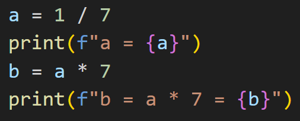
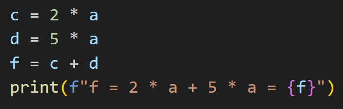
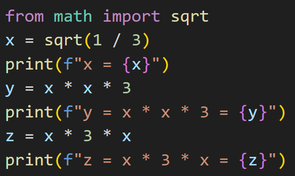
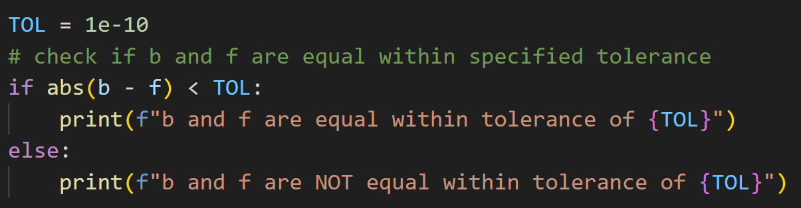
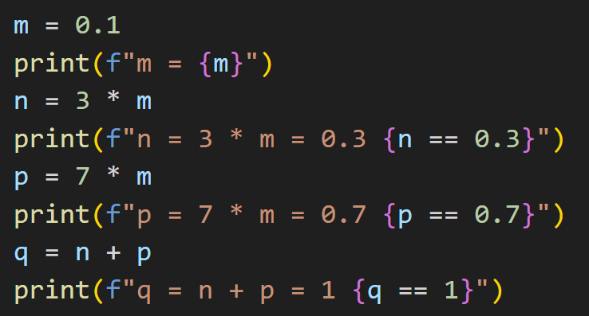

# ENGR 102 Lab Topic 4 (team)
This lab consists of four team activities. Please submit the following files to Gradescope. Please include the team header information at the top of each file with the names of all contributing team members. This is a team assignment, but **everyone** must submit the files for credit. You may discuss the problems with other teams, but your submitted work must be unique. Check out the [Frequently Asked Questions](#frequently-asked-questions) below.

## Activities

1. [Roundoff Error](#roundoff-error)
2. [Make Change](#make-change)
3. [Pretty Equation](#pretty-equation)
4. [Boolean Expressions](#boolean-expressions)

## Roundoff Error
When performing numerical computations, one of the challenges you can run into is floating-point roundoff error. This occurs when the computer needs to represent a number that would require an infinite number of decimal digits, but rounds them off after some point. That small roundoff error can cause some significant issues. This activity is meant to help you understand floating-point roundoff error a bit more and learn about one way of dealing with it. Create a Python file named `roundoff_error.py` for the following three-part activity. Please separate the various parts of your code with the following comment identifying the separate sections (copy/paste into your file with the appropriate letter).
```
############ Part A ############
```

### Part A: Identifying floating-point problems
First, **type** and run the following program:



Notice that the value of `a` is rounded off. The value of `b`, if we have no roundoff, should be `1`. Is it? *Make a comment in your code answering the question.*

Now add the following lines:



In this case, the value of `f`, if we have no roundoff, should be `1`. Is it? *Make a comment in your code answering the question.*

Finally, add the following lines:



Again, the values of `y` and `z`, if we have no roundoff error, should be `1` in both cases. Are the values 1? *Make a comment in your code answering the question.*

Was that surprising? You should have seen from those examples that sometimes we will encounter issues due to roundoff error and sometimes we won’t. We can’t always predict when roundoff error will be obvious.

### Part B: Tolerances for Comparisons
In Part A, you should have seen that two different ways of computing values that should be identical might actually produce values that are different, if only by a tiny bit. In some cases, this is not a problem. For example, we usually don’t care if speed is incorrect in the 10<sup>th</sup> decimal place, since we usually can’t measure speed that precisely anyway. But, floating point error can become a big problem if comparisons are made with floating-point values.  

A common way for dealing with floating-point error is to use tolerances. Tolerances let you compare two values that are close, but not identical to each other. Rather than checking whether or not `a == b`, we instead compute the absolute value of the difference in `a` and `b` and see if that quantity (the difference) is within some small distance away from `0` (either above or below). That small value, called the tolerance, is decided upon by the programmer and the value chosen is highly dependent on the problem at hand. If the absolute value of the difference between `a` and `b` is less than the tolerance, then we may consider `a` and `b` to be equal for the problem at hand. The tolerance is commonly abbreviated `TOL` or `EPS` (short for epsilon (`ε`)). `1e-6` is usually a good value for tolerance, but may vary with specific applications.

Add to your code from Part A the following lines to compare values of the variables `b` and `f` using the concept of tolerance:



Add a similar tolerance check to your code for `y` and `z`. 

As you write programs, think about your comparisons and decide if you need to use tolerances. If you are making a comparison to check for exact equality and you might have some floating-point error, you will probably want to use tolerances, while if you are just checking which of two things is larger, a tolerance comparison is likely unnecessary. Tolerances are particularly helpful when checking things like whether a denominator is (nearly) 0, and thus a division is likely to create error.

### Part C: Illusions of Precision
Computers operate in base 2 (binary). No matter how many digits you are willing to use, some numbers still cannot be represented exactly, like the number 0.1. Most people aren't aware that 0.1 is stored as an approximation because Python keeps the number of digits manageable by displaying a rounded value. Even though the printed result of a calculation may look exact, know that the actual stored value is the nearest representable binary fraction.

Add to your code from Part B the following lines:



Did the results surprise you? If you rewrote your program for [Lab Topic 1 Activity 3](https://github.com/tamu-edu-students/engr-102-lab-1?tab=readme-ov-file#follow-directions) using variables and successive divisions for `x` (`x = 1/10`, `x = 1/100`, etc) would you expect to see the same output as your original program? Check out this link to the Python documentation: https://docs.python.org/3/tutorial/floatingpoint.html. This info helps explain these issues. As the document states, ". . .this is not a bug in Python, and it is not a bug in your code either." Instead, the problems stem from the way a floating-point number is represented by the hardware. **Awareness of these issues may save you a lot debugging effort in the future.** Also check out this link: Binary Tutorial - 5. Binary Fractions and Floating Point https://ryanstutorials.net/binary-tutorial/binary-floating-point.php


## Make Change
Write a program that computes the change made when someone buys something. Your program should prompt the user to input from the keyboard how much they paid and how much it costs. Your program should then output the change and list how many of each type of coin. You may assume the change is always less than $1.

**Although this may seem like an easy task, it can be quite challenging to get right. You MUST *think before you code*. Discuss with your team how to approach the problem and develop an algorithm (a sequence of steps to perform a computation or solve a problem) for any possible input. This task may take up to 30 minutes. It will take much longer if you do not think before you code.**

**First**, your team should develop and document an algorithm for solving this problem. You may choose to write it by hand, type it in a document, draw a picture, etc, but you do not have to turn it in. Manually check your algorithm and check your answers versus the examples given below as well as others you come up with. *You should not code until you develop and check your algorithm by hand*. **After you develop an algorithm**, translate it into Python code and name your file `make_change.py`. Verify that your code delivers the correct output for all of the examples you thought up.

Your program should perform the following general tasks:
- Store input in appropriately named variables
- Convert the input to a number if you plan to perform mathematical operations with the input value
- Perform necessary decisions/procedures/calculations and store results in appropriately named variables
- Output results to the screen using the format below

Example output (using inputs `1`, `0.71`):
```
How much did you pay? 1
How much did it cost? 0.71
You received $0.29 in change. That is...
1 quarter
4 pennies
```

Example output (using inputs `2`, `1.02`):
```
How much did you pay? 2
How much did it cost? 1.02
You received $0.98 in change. That is...
3 quarters
2 dimes
3 pennies
```

**Hint**: You may encounter a case where your code doesn't calculate the correct change. It may be helpful to reread [Activity #1 (Roundoff error)](#roundoff-error) in this lab.


## Pretty Equation
A quadratic equation is an equation of the form $$Ax^2+Bx+C = 0$$ where `A`, `B`, and `C` are the coefficients of the equation. Write a program named `pretty_equation.py` that takes as input the coefficients `A`, `B`, and `C` and outputs the quadratic equation in a nice format. Your program should not print the coefficient `1` or a term with a coefficient `0` and should replace plus signs (`+`) with minus signs (`-`) for negative coefficients. Include one space between the sign and the term. You may want to review the string formatting document posted with Lecture 3 and [Lab 3 (team)](https://github.com/tamu-edu-students/engr-102-lab-3-team). Use the output format shown below. You may assume the user only enters integers.

Example output (using inputs `-1`, `-2`, `3`):
```
Please enter the coefficient A: -1
Please enter the coefficient B: -2
Please enter the coefficient C: 3
The quadratic equation is - x^2 - 2x + 3 = 0
```


## Boolean Expressions
The purpose of this program is to give you practice with performing Boolean logic with Python. Create a file named `boolean_expressions.py` for this activity. Each team member is responsible for knowing this material, and it may be a good idea for all team members to practice keying in the code given. You are required to include code for Part A, Part B, and Part C below in your file for submission. Part D is optional and should be included in your file if you attempt it. **Please separate the various parts of your code with the following comment to identify the separate sections (copy/paste into your file with the appropriate letter).**
```
############ Part A ############ 
```

### Part A: Inputting Boolean values from the keyboard
Write a simple code to take as input from the user Boolean values from the keyboard for variables `a`, `b`, and `c`. The user will enter a value to indicate Boolean True and Boolean False from the keyboard, and your code should create a Boolean variable representing the user's input. **Use Boolean expressions to create these variables**; do **NOT** use `if-else` blocks. These Boolean variables will be used in Boolean expressions in parts B, C, and D.

The user should be able to enter `True`, `T`, or `t` for Boolean `True`. To indicate Boolean `False`, the user should be able to enter `False`, `F`, or `f`. **Note**: Numeric input is **not** permissible. *If this proves to be a bit of a challenge, review Lecture 3 slides covering Boolean expressions and assignment.*

### Part B: Evaluating Booleans
Add to your program code that evaluates the following Boolean expressions using the variables `a`, `b`, and `c` from Part A. The program should output the value `True` or `False` of the expression for the entered values. Use Boolean expressions; do **NOT** use `if-elif-else` blocks. See the example output below.
1. a and b and c
2. a or b or c

### Part C: Writing Boolean expressions
Extend your program above to include Boolean expressions (do **NOT** use `if-elif-else` blocks) that meet the criteria in each item below using the variables `a`, `b`, and `c` from Part A. Your program should output the value `True` or `False` based on the previously entered values.
1. Given values for two Boolean variables `a` and `b`, create a Boolean expression for "exclusive or" or "XOR" between `a` and `b`. This expression evaluates to `True` if just one of `a` or `b` is True, but not if both are True or both are False. Do **NOT** use `^`, instead use **only** `not`, `and`, and `or` to construct an equivalent statement.
2. Given values for three Boolean variables `a`, `b`, and `c`, create a Boolean expression to determine if `True` was entered an odd number of times. This expression evaluates to `True` if exactly 1 or 3 of the variables `a`, `b`, and `c` is True, and is `False` otherwise. Use **only** `not`, `and`, and `or`.

Example output (using inputs `T`, `T`, `T`):
```
Enter True or False for a: T
Enter True or False for b: T
Enter True or False for c: T
a and b and c: True
a or b or c: True
XOR: False
Odd number: True
```

### Part D: Other Activities (Optional 1 bonus point)
- Part D is strongly suggested for those wanting to major in Computer Science, Computer Engineering, Electrical Engineering, or another computationally heavy field.
- If you would like to learn more about Boolean Expression Simplification, follow this link to see the list of rules used for the Boolean expression simplifications: 
http://sandbox.mc.edu/~bennet/cs110/boolalg/rules.html
- Keep in mind that multiplication represents Boolean `and` and addition represents Boolean `or`. That means `AB` is equivalent to `A and B`, `A+B` is equivalent to `A or B`, and `A-bar` is equivalent to `not A`.
- Then take a look at the examples at http://sandbox.mc.edu/~bennet/cs110/boolalg/simple.html. Note that `T` stands for `True`.

Add to your program above using the variables `a`, `b`, and `c` from Part A and evaluate the following Boolean expressions.  
1. `(not (a and not b) or (not c and b)) and (not b) or (not a and b and not c) or (a and not b)`
2. `(not ((b or not c) and (not a or not c))) or (not (c or not (b and c))) or (a and not c) and (not a or (a and b and c) or (a and ((b and not c) or (not b))))`

Then, create simpler (reduced) versions that still give the same results. Your program should output the value `True` or `False` based on the previously entered values. Output the results of the complex expression and the simple version. **If your team completes Part D correctly, you will receive 1 bonus point on this assignment.**

Part D example output (using inputs `T`, `T`, `T`):
```
Complex 1: False
Simple 1: False
Complex 2: True
Simple 2: True
```

**Hint**: There are 2 possible values for each of `a`, `b`, and `c`. Any expression that evaluates the same for all possible combinations of `True`/`False` of those values is an equivalent Boolean expression! 


## Frequently Asked Questions
1. **What is tolerance?** Tolerance is the engineering version of wiggle room. Computers work in binary (base 2) so some numbers can't be represented exactly. Instead they get rounded off in the 15th or so decimal place. That means when we do math with rounded numbers, that very small error gets carried through. It's like using `3.14` instead of `3.1415926` for `pi`. So even though my calculation is correct, it has a small rounding error and isn't exactly equal. This could be a problem when you use conditional statements. `0.9999999` isn't exactly equal to `1.0`. But if the rounding error is in the 10th decimal place... who cares? Engineers rarely need to have that kind of precision. So we use tolerance to give us some wiggle room in our code. If our calculated answer is within some tolerance (the absolute value of my answer minus the real answer is very small) then they are effectively equal.

2. **Activity 2 (make change) do I have to manually check all possible cases?** Do you have to? No. *Should* you? Yes! How do you know your code works if you don't test it thoroughly? Of course if you're lazy you can just submit to Gradescope and see if it passes all of my tests. :)

3. **Activity 3 (pretty equation) how do I separate the minus sign from a negative number?** Get clever! This is a great time to use an if statement. If the number is negative, use string concatenation to display a minus sign, space, and the number times -1 (to flip the sign). The absolute value function may also be useful: `abs(number)`.

4. **Activity 3 (pretty equation) I am frustrated. Why is this problem so hard?** Well, I thought this problem would be a fun challenge, but you're right, it is hard. You will need several `if-elif-else` statements and will likely need to nest some of them. If you're struggling, ask for help during class!

5. **Activity 3 (pretty equation) I tried using backspace (`\b`) and Gradescope labels it `\x08` instead. What's going on?** Gradescope displays the `\b` character as `\x08`. To get around using `\b`, try building up your equation string one piece at a time using string concatenation. For example:
```python
a = 1
b = 2
c = -5
myeq = "x^2"
myeq += " + " + str(b) + "x"
myeq += " - " + str(abs(c)) + " = 0"
print(myeq)
```
6. **Activity 4 (Boolean expressions) I can't use `if-elif-else` blocks?!** Nope! You don't need `if-elif-else` blocks for this activity. Instead, use Boolean expressions. You know, something like `a and not b` which evaluates to a Boolean value. Try saying it out loud (in English) then translate to Python. 

7. **Activity 4 (Boolean expressions) the comment test case is failing but I commented my code. What gives?** Did you include the comment to separate sections of your code? Make sure you have the right number of `#`'s on that line.

Have a question you don't see here? Email your instructor!

Based upon Dr. Keyser’s Original<br/>
Revised Summer 2025 SNR
